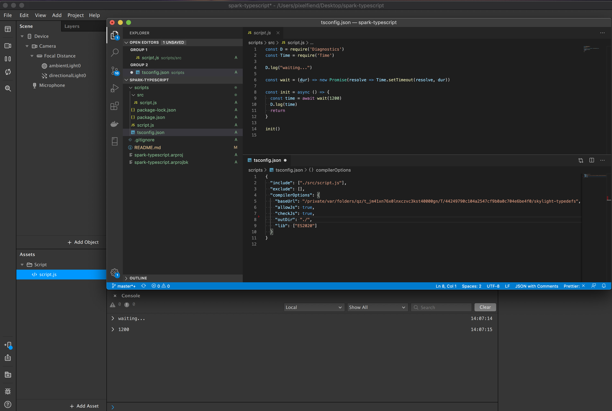

## Typescript for Spark AR

UPDATE: v106+ supports typescript natively

Out of the box, the Spark AR JS runtime doesn't support things like async/await, or Array.includes. This project shows how to configure the tsconfig so it will compile your modern JS into something that plays nicely with Spark.

It's a bit of a hack, since there's not a complete source for Spark types, but they are referenced in the default tsconfig that is generated when you add a script to your project. As a result, typescript will complain about missing references. As far as I can tell, the compiler works fine, but the type checker will complain every time.

### Dependencies

Install [NodeJS](https://nodejs.org/en/) LTS.

Install the dependencies:
- `cd scripts`
- `npm i`

### Development

Run `npm start` from the scripts dir to watch src/script.js for changes, and recompile during development.

## Resources

Related: https://github.com/mikkoh/ts-spark-ar

Learn more stuff by watching my [Spark AR Tutorials on YouTube!](https://www.youtube.com/playlist?list=PLAZp2Vi7Gfspzyla4RrCO6BzVzYW7Lnb-)

Follow me on Instagram [@positlabs](https://instagram.com/positlabs) and try out my effects!

Browse my open-source [Spark AR repositories on Github!](https://github.com/search?q=user%3Apositlabs+spark)

Have questions? Join the [Spark AR Community](https://www.facebook.com/groups/SparkARcommunity/) group on Facebook.

## Donations

If you used this in client projects, or simply enjoyed making effects with my open-source projects, please consider a donation or sponsorship. One-time donations can be made with PayPal. Subscriptions can be through PayPal or [Github Sponsorships](https://github.com/sponsors/positlabs).

